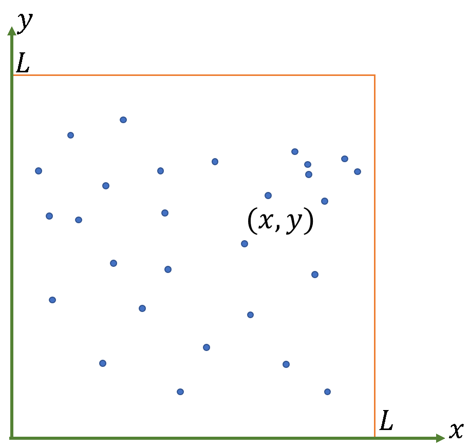

# 树：查找临近点

## 问题描述

如下图所示，在一个以(0, 0), (L, 0), (L, L), (0, L) 为顶点的正方形内，给定二维空间中一组包含N个点的集合A，其中第i个点的坐标为Pi(ai, bi)。

在上述区域内，给出另一个包含M个点的待查询点集B，对B中的每个点 Qj(xj, yj), 试报告点集A中与其距离不超过dj的点的个数nj：

nj = | { P∈A | d(P, Qj) <= dj } |, 其中 0 <= dj <= L/2



为了简化问题，我们做如下约定：

- 采用切比雪夫距离定义。在二维平面上，点 P1 和点 P2 的坐标分别为 (x1, y1) 和 (x2, y2)，那么根据切比雪夫距离的定义有：

             d(P1, P2) = max( |x1-x2|, |y1-y2| )

- 点集 A 和点集 B 中所有点的坐标都是整数。

- 点集 A 中没有任何两个点的 x 坐标或 y 坐标相重。即：

              ∀ Pi ∈ A，∀ Pj ∈ A， i≠j，那么有 xi ≠ xj 且  yi ≠ yj

- 0 < M,N <= 10^5, 0 < L <= 10^6

## 输入格式

首行包含两个正整数 n>0, m>0. 其中 n = |A|, m = |B|. 也即，n为平面上的点数，m为待查询点的个数。两个数以空格分隔。

随后 n 行中的第 i 行给出 A 中第 i 个点：(ai, bi), i = 1, 2, ... , n

这里，ai 和 bi 均为整数，两个整数以空格分隔。

此后 m 行中的第 j 行给出点集 B 中第 j 个待查询点的坐标和相应的待查询距离：(xj, yj, dj), j = 1, 2, ..., m

这里，xj, yj, dj 均为整数，三个整数以空格分隔。

## 输出格式

共 m 行，第 j 行对应 B 中第 j 个点的查询结果。

## 输入样例

``` text
4 2
4 7
8 4
2 9
5 3
5 4 3
2 5 1
```

## 输出样例

``` text
3
0
```
